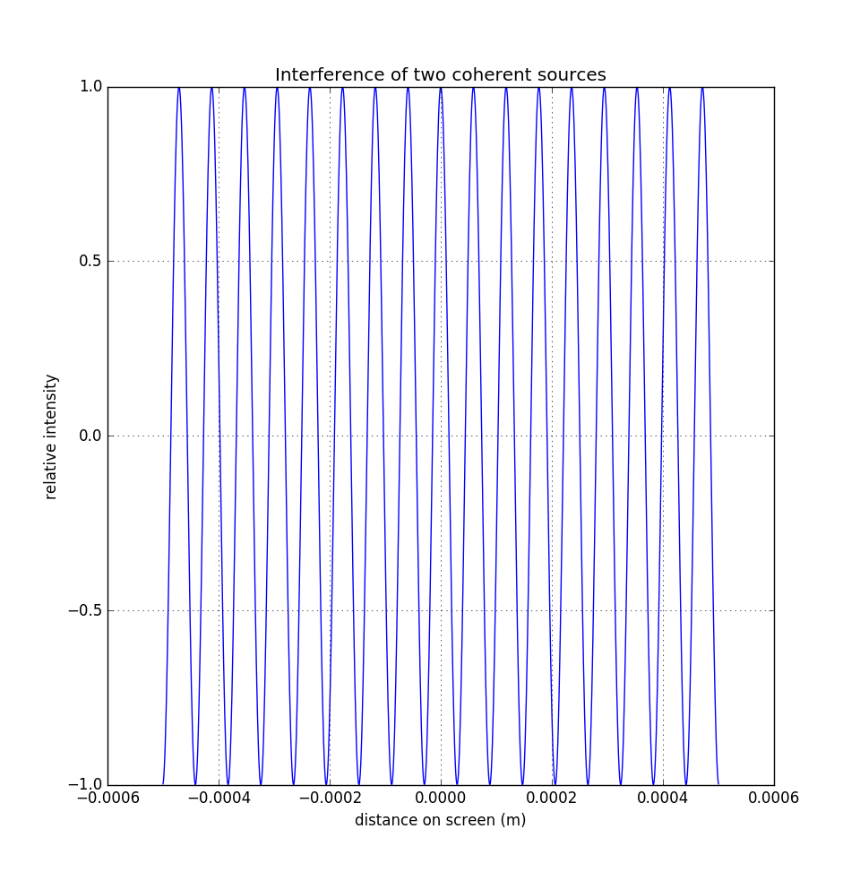

# Python-interference

Calculating and displaying the interference pattern of:
* Two coherent sources: display the interference pattern on a screen.
* N coherent sources: display the relative intensity of a coherent source received by n receivers at a variable angle

## Disclaimer

Keep in mind that this is just a project for fun and to learn some python. Use the results at your own risk. You are free to copy and/or modify the code under MIT License.
